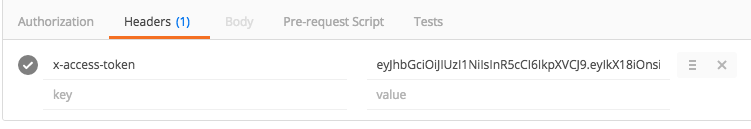

This application shows you how to use a Node.js with a Token authentication.

You need to have a mongodb running locally to save the users we are going to create on this project.


##Explanation

####server.js

On the server.js file you have the basic routes: 

The first one '/' will return a "Hello World" message

The second one '/setup' will create a user with a name and password set.

The third one '/api' uses a express router we are going to define below

####router.js

On the router.js file you have all the routes used by '/api'

The first one '/authenticate' will return a token if password and user are the same we have on the database

The second one is the middleware. This middleware will try if the token we send is the same with the token we gave to the user. So every time we want to access to the routes '/' or '/users' on the router this middleware will try if the token is valid or not.

If the token is valed it calls next() and allows to use the routes below.

The third one is '/' it will send us a random message only if we have sent a valid token

The fourth one is '/users' it will return all the users on the database if we have sent a valid token on the headers. 

####config.js

This file has the secret word used to create a token and the database path.

####user.js

This is the model used by mongoose to create the users on the database.

##How to try

Run a mongo database on your computer

```
sudo mongod
```

Send a request with GET to create try the express routes. You can use Postman to do this. 

http://localhost:8080

You will recieve 'Hello World'

Now create a user sending a request to

http://localhost:8080/setup

A user will be created on the database 

> Name: Luis
> Password: password 

Now you need to send a post to authenticate the user and get a Token. Send a request with POST  and body with name and password to 

http://localhost:8080/api/authenticate

You will get a response with a Token. Save that token. We will need it.

Finally you can access to the following routes:

http://localhost:8080/api
http://localhost:8080/users

**Only** if you send the token on the header of your post, otherwise you won't be able to get the information and you will recieve an error like "No token provided"




